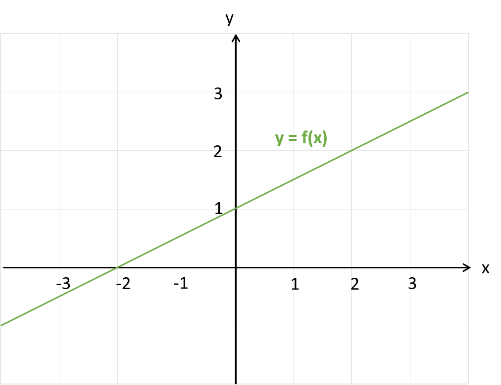

# Python Lab English | [German](lab.md)

| Chapter                                                    | Exercises |
| ---------------------------------------------------------- | ------- |
| **[1. Kick Start](#1-kick-start)**                         | [HelloWorld](#HelloWorld) - [HelloJupiter](#HelloJupiter)   |
| **[2. Basics](#2-basics)**                         |  |
|   [2.1 Operators & variables](#21-operators--variables)  | [Rechteck](#Rechteck) - [Fahrenheit](#Fahrenheit)  |
|   [2.2 Control structures](#22-control-structures)         | [Note](#Note) - [Modulo](#Modulo) - [Quadrat](#Quadrat) - [Group](#Group) |
|   [2.3 Exceptions](#23-exceptions)                           | [Validation](#Validation) |
|   [2.4 Functions & lambda](#24-Functions--lambda)        | [Maximum](#Maximum) - [Square](#Square) - [Linear](#Linear)  |
| **[3. Data types](#3-data-types)**               | Datenstrukturen |
|   [3.1 Strings](#31-Strings)                               | [Compare](#Compare) - [SplitDate](#SplitDate) |
|   [3.2 List & Tuples](#32-List--Tuples)                    | [Numbers](#Numbers) - [Filter](#Filter) |
|   [3.3 Sets](#33-Sets)                                     | [Mengen](#Mengen) |
|   [3.4 Dictionaries](#34-Dictionaries)                     | [I18N](#I18N) - [Artikel](#Artikel) |
| **[4. Classes & objects](#4-classes--objects)**            | [Kreis](#Kreis) - [Zylinder](#Zylinder) - [Fahrzeug](#Fahrzeug) - [MathUtil](#MathUtil) - [UnitTest](#UnitTest) |
| **[5. File Input/Output](#5-file-inputoutput)**            | [Names](#Names) - [Books](#Books) |
| **[6. Modules & Packages](#6-modules--packages)**            | [Calculator](#Calculator) |
| **[7. Standard Libraries](#7-standard-libraries)**         | [Directories](#Directories) - [RegEx](#RegEx) | 
| **[8. Data Science Libraries](#8-data-science-libraries)** | [Calculations](#Calculations) - [Mathplot](#Mathplot) - [Umsatz (Excel)](#Umsatz) - [Footprint(CSV)](#Footprint) - [Covid (JSON)](#Covid) |
| **[9. Applicaton examples](#9-applicaton-examples)**       | [SciKitLearn](#SciKitLearn) - [Bookservice](#Bookservice) - [HelloStreamlit](#hellostreamlit) - [Sales (Streamlit)](#sales-streamlit) |
| **[10. Further exercises](#10-further-exercises)**             | [Tree](#Tree) - [Caesar](#Caesar) - [Schaltjahr](#Schaltjahr) |

## 1. Kick Start

### HelloWorld
- Create the script `helloworld.py` and output the text "Hello World".
- Read a name and output the text "Hello [Name]". The name corresponds to the input.
- Example output:
  ```
  Hello World

  Please enter your name: Beatrice
  Hello Beatrice
  ```

**Note:**
- To read an input value you can use the method input(), as shown in the sample below:
  ```
  input = input("Please enter a text:")
  ```

### HelloJupiter
- Open the Jupiter Notebook `hellojupiter.ipynb` and perform the steps listed.
- Supplement the explanations given with your own experiments.

**Note:**
- To read an input value you can use the method input(), as shown in the sample below:
  ```
  input = input("Please enter a text:")
  ```

## 2. Basics

## 2.1 Operators & variables

Operators, variables, comments, help & type information

### Rechteck
- Create the script `rectangle.py` and define two variables for the length and width.
- Initialize the length with the default value 10 and the width with the default value 5.
- Calculate the perimeter and the area of the rectangle and output the results on the console.
- Example output:
  ```
  Rectangle with length 10 and width 5
  - perimeter = 30
  - Area = 50
  ```

### Fahrenheit
- Create a script `fahrenheit.py` and read from the console the temperature in Fahrenheit.
- The number read in is of type integer (int). Convert it to a floating point number (float).
- Calculate the temperature in degrees celsius using the formula:
  **degrees Celsius = 5 * (Fahrenheit-32) / 9**.
- Output the result to the console.
- Example output:
  ```
  Temperature in Fahrenheit = 75.2
  Fahrenheit = 75.2
  Degree Celsius = 24.0
  ```

**Note:**
- To read an input value you can use the method input(), as shown in the sample below:
  ```
  input = input("Please enter a text:")
  ```
 
## 2.2 Control structures

### Note
- Create the script `note.py`, which reads a note in the range 1-6 as integer from the console. For this you have to convert the input with a cast to an int.
- Check the note  and if the value is greater than or equal to 4, output
  the following text: "The test is passed".
- If the value is less than 4, output the text "The test is not passed".
- Start the script with different values and check the output.
- Now complete the previous output with a detailed indication of the grade:
  - Grade 6: very good
  - Grade 5: good
  - Grade 4: sufficient
  - all other cases: insufficient

**Note:**
- To read an input value you can use the method input(), as shown in the sample below:
  ```
  input = input("Please enter a text:")
  ```

**Extension:** 
- Add an input validation, by checking if the input value is a number and if the number is within
the valid range from 1 to 6. 
- If no number was passed make the following output and exit the program: "Wrong call: Please pass a number!"
- If the entered value is not in the range from 1 to 6, make the following output and exit the program:"Wrong value: The note must have a value between 1..6!"


### Modulo
- Create a script `modulo.py` that outputs all odd numbers between 1 and 30 one after the other. 
- Use the modulo operator `%` for this.

  
### Quadrat
- Create a script that outputs all square numbers in a loop.
- The loop has to be executed as long as the calculated square number is less than or equal to 15.
- Example output: 
  ```
  1 x 1 = 1
  2 x 2 = 4
  etc.
  ```


### Group
- Create a script `group.py` with the following mixed list: [7.5, 'Hello', 42, None, 'World', 1.25, 69, 12]  
- Group the list entries into three different lists for integer, floating point, and string types.
- Output the result to the console.
- Example output: 
  ```
  values = [7.5, 'Hello', 42, None, 'World', 1.25, 69, 12]
  - int = [42, 69, 12]
  - float = [7.5, 1.25]
  - str = ['Hello', 'World']
  ```

       
## 2.3 Exceptions

### Validation
- Create a script `validation.py` that reads in arbitrary integers.
- The values are read in with the input() method. This method returns a string.
- The string should now be converted to an integer and stored in a list.
- If instead of an integer a string or a floating point number is entered, 
  the error should be caught during the conversion and a corresponding error message should be output.  
- As soon as an 'x' is entered, the input will be terminated and the entered values should be printed out as a list.
- Example output: 
  ```
  Please enter an integer or 'x' to terminate the input:
  value = 1
  value = 7
  value = 9.5
  Invalid value: 9.5 Please enter an integer value!
  value = 9
  value = x
  
  Entered values:
  [1, 7, 9]
  ```

## 2.4 Functions & lambda

### Maximum
- Create a script `maximum.py` with a function for the calculation of the maximum.
- The function can be passed 3 numbers. The largest number is returned as the result.
- It should also be possible to call the function with only 2 numbers. For this you can give the third
  parameter the default value `None` and check this in the method accordingly. 
- Example output:
  ```
  max(1,2) = 2
  max(2,1) = 2
  max(9,-15,-12) = 9
  max(9, 15,-12) = 15
  max(9,-15,12) = 12
  ```

### Square
- Create a script `square.py` with a lambda expression that gets a number as parameter and returns  the square number. 
- Test the lambda expression with some examples.


### Linear
- Create a script `linear.py`. 
- Implement the formula for calculating y as a function of x as a lambda expression.
- Check the formula and calculate the values of y for the x values -2, -1, 0, 1, 2 and 3.
  
- Example output:
  ```
  y for x -2 = 0.0
  y for x -1 = 0.5
  y for x 0 = 1.0
  y for x 1 = 1.5
  y for x 2 = 2.0
  y for x 3 = 2.5
  ```


## 3. Data types

## 3.1 Strings

### Compare
- Create the script `compare.py` which reads two names.
- Output the names alphabetically sorted on the console.
- Example output:
  ```
  Please enter:
  Name 1 = Zoé
  Name 2 = Andrea

  Sorted names:
  Andrea
  Zoé
  ```

**Note:**
- To read an input value you can use the method input(), as shown in the sample below:
  ```
  input = input("Please enter a text:")
  ```


### SplitDate
- Create the script `splitdate.py` and define a string which contains a date 
  with days, month and year like for example "17.04.1966" or "1.3.07".
- Now split the input into three individual strings for the days, month and year. 
- Output the individual strings to the console.
- Example output:
  ```
  date: 17.04.1966
    day = 17
    month = 04
    year = 1966
  Date: 3/1/07
    day = 1
    month = 3
    year = 07
  ```

**Note**:
- Try to find a second solution approach. 
- One possibility is using the split() method, another possibility is using the index()
  method together with slicing.


## 3.2 List & Tuples

### Numbers
- Create the script `numbers.py`.
- Create a tuple of `numbers` with the following values: (7, 9, 16, 23, 4, 12, 99, 5).
- Select the following elements and output them to the console:
  - First and last element
  - First two elements, Last two elements
  - Number of elements (length), minimum and maximum
- Example output:
  ```
  (7, 9, 16, 23, 4, 12, 99, 5)
  7
  5
  (7, 9)
  (99, 5)
  8
  4
  99
  ```


### Filter
- Create the script `filter.py`.
- Create a list `numbers` with the numbers 1..20 and output it to the console.
- Select all even numbers from the list and save them to the `even_numbers` list. 
  Use a loop to do this. Output the result on the console.
- Select all odd numbers from the list and save them to the list `odd_numbers`. 
  Use the filter() function to do this. Output the result to the console.
- Example output:
  ```
  [1, 2, 3, 4, 5, 6, 7, 8, 9, 10, 11, 12, 13, 14, 15, 16, 17, 18, 19, 20]
  [2, 4, 6, 8, 10, 12, 14, 16, 18, 20]
  [1, 3, 5, 7, 9, 11, 13, 15, 17, 19]
  ```

## 3.3 Sets

### Mengen

- Create the script `sets.py` and define the two sets blue and green as shown.
- Perform the Union, Intersection, and Difference set operations and output the results to the
  on the console. 
- Example output:
  ```
  Union blue+green = {'A', 'B', 'D', 'C', 'E'}
  Intersection blue/green = {'C'}
  Difference blue-green = {'A', 'B'}
  Difference green-blue = {'D', 'E'}
  ```


## 3.4 Dictionaries

### I18N

  | Key  | Greeting     | 
  | --- | ------------- | 
  | de  | Guten morgen  |
  | fr  | Bon jour      |
  | it  | Buongiorno    |
  | en  | Good morning  |

- Create the script `i18n.py` and manage the greetings from the table in a dictionary with the
  key as the key and the greeting as value.
- Read a name and the language key from the console and greet the person in the given language.
- If an invalid language key is entered, use the key for English as the default. 
- Example output:
  ```
  Please enter your name: Anna
  Select the language [de, fr, it, en]: fr

  Bon jour
  Anna
  ```

### Artikel

  | Nr  | Name                      | Price  |
  | --- | ------------------------- | ------ |
  | 11  | Bildschirm Belinea X3     | 499.50 |
  | 12  | PC Tastatur Swiss German  |  35.00 |
  | 13  | Logitec Maus              |  17.25 |
  | 14  | USB Hub                   |  25.70 |
  | 15  | Lautsprecher X66-12       |  87.90 |


- Create the script `article.py` and manage the articles from the table above in a dictionary:
  - You can use the article number as key for an article entry. 
  - Each entry is again a dictionary with the fields name and price and theirs values.
- Now output all articles on the console.  
- Find the article with the lowest price and display it on the console.
- Update all items prices and give a disount of 20%. 
  Output the items on the console.
- Example output:
  ```
  List all articles:
  {'name': 'Screen Belinea X3', 'price': 499.5}
  {'name': 'PC Keyboard Swiss German', 'price': 35.0}
  {'name': 'Logitec Mouse', 'price': 17.25}
  {'name': 'USB Hub', 'price': 25.7}
  {'name': 'Speaker X66-12', 'price': 87.9}

  Show article with lowest price:
  {'name': 'Logitec Mouse', 'price': 17.25}

  Give a 20% discount of all prices and list articles:
  {'name': 'Monitor Belinea X3', 'price': 399.6}
  {'name': 'PC Keyboard Swiss German', 'price': 28.0}
  {'name': 'Logitec Mouse', 'price': 13.8}
  {'name': 'USB Hub', 'price': 20.56000000002}
  {'name': 'Speaker X66-12', 'price': 70.320000000001}
  ```


## 4. Classes & objects

### Kreis
- Create the script `kreis.py`.
- Create the class `Kreis` with the attribute radius.
- Create the method get_circumference() which returns the circumference (2*PI*radius) of the circle.
- Create the method get_area() which returns the area of the circle (PI * radius^2)
- Create the print() method that prints the radius, circumference and area to the console.
- Test the class with several different values.
- Example output:
  ```
  Circle with radius 3
  - circumference = 18.849
  - Area = 28.274
  ```
 
**Note:**
- There is a predefined constant for PI in the Python math module:
  ```
  import math
  print (math.pi)
  ```

### Zylinder 
- Create the script `zylinder.py`.
- Create the class `Zylinder`, which extends the class Circle with an additional 
  attribute for the height.
- The class should have a constructor where the radius and the height can be specified.
- Create the method volumen() which returns the volume (area * height) of the cylinder.
- Overwrite the method print() so that the data of the cylinder is output.
  
- Create one instance each of circle and cylinder and call the two print()   
  methods.
- Example output:
  ```
  Circle with radius 3
  - circumference = 18.84955592153876
  - Area = 28.274333882308138
  Cylinder with radius 3 and height 5
  - Volume = 141.3716694115407  
  ```

**Note:**
- The Circle class can be imported into the Cylinder file as follows:
  ```
  from circle import circle
  ```
  
### Fahrzeug
- The following vehicles are to be mapped in an inheritance hierarchy:
  - Fahrrad with the attributes Farbe, Baujahr, Marke and the operations: 
    - fahren() prints the text "bicycle is driving" on the console 
    - print() prints all attribute values
  - PKW with the attributes Farbe, Baujahr, Sitzplätze and the operations:
    - fahren() prints on the console the text "PKW fährt". 
    - print() prints all attribute values
- Create a class diagram with an inheritance hierarchy so that the common 
  attributes and operations are grouped into a common superclass.
- Implement the class diagram using Python in the file `fahrzeug.py`.
- Create a test and verify your solution by creating one instance each of
  Bike and Car and calling the print() and drive() methods.
- Example output:
  ```
  Fahrrad mit Farbe=silber, Baujahr=2020, Marke=Scott
  Fahrrad fährt...
  PKW mit Farbe=rot, Baujahr=2007, Sitzplätze=4
  PKW fährt...
  ```

### MathUtil
- Create the script `mathutil.py`.
- Create a class `MathUtil` with the following static methods:
  - min (a, b, c)
    Calculate and return the minimum of the three numbers.
  - max (a, b, c)
    Compute and return the maximum of the three numbers.
- Test the two auxiliary methods with different numerical values and print the results
  on the console.
- Example output:
  ```
  The maximum of 5,12,20 is: 20
  The minimum of 5,12,20 is: 5
  The maximum of 49,3,14 is: 49
  The minimum of 49,3,14 is: 3
  ```

### UnitTest

**Preparation**
By default, unit tests are disabled in the VS Code. You have to activate them first, please follow the installation notes.


**Unit tests**
- Unit tests help us to test the code automatically. 
- Thereby the method to be tested is called and the actual result is compared with an expected value. For this purpose there are appropriate comparison methods. 
- Unit tests can be called directly from the development environment as well as from automated CI/CD pipelines.

**Task**
- The two methods `min()` and `max()` of the MathUtil class are to be checked with a unit test.
- For this a test class is needed as follows:
  ```
  import unittest
  class MathUtilTest(unittest.TestCase):
    ...
  ```
- For each test you want to run, you can now create a method with the `test` prefix
  and check the desired function.
  ```
    def test_max(self):
        expected = 20
        actual = MathUtil.max(5,12,20)
        self.assertEqual(expected, actual)
  ```
- Create the script `mathutil_test.py`.
- Create the class `MathUtilTest.py` and define the corresponding test methods to check
  the two methods `min()` and `max()`.
- Run the test from the development environment and check the results.


## 5. File Input/Output

### Names
- Create the script `names.py` and read the text file [names.txt](05-file/names.txt).
- This contains first names in the following form:
  ```
  Elias
  Theo
  ...
  Ida
  Anna
  ```
- Sort the first names alphabetically and save them again in text format.
- Example `names-sortet.txt`:
  ```
  Anna
  Anton
  ...
  Sarah
  Theo
  ```


### Books
- Create the script `books.py` and read the text file [books.txt](05-file/books.txt).
- It contains book data in the following form:
  ```
  ISBN
  Title
  Author
  Publisher

  978-0-316-45742-2
  The Coast-To-Coast Murders
  James Patterson
  Little Brown USA

  978-0-525-95498-9
  ...
  ```
- Now create a list of entries. Each entry contains the data of a "block" and is itself
  itself also a list, as shown below. 
  ```
  ['ISBN', 'Title', 'Author', 'Publisher']
  ['978-0-316-45742-2', 'The Coast-To-Coast Murders', 'James Patterson', 'Little Brown USA']
  Etc.  
  ```
- Save the processed data in CSV format.
- Example `books.csv`:
  ```
  ISBN,Title,Author,Publisher
  978-0-316-45742-2,The Coast-To-Coast Murders,James Patterson,Little Brown USA
  978-0-525-95498-9,The Evening and the Morning,Ken Follett,Penguin LCC US
  978-1-250-14523-9,All the Devils Are Here,Louise Penny,Macmillan USA
  ```

## 6. Modules & Packages

### Calculator
- Create the module `calculator.py` with the following methods:
  - add(x, y) for the addition x + y
  - sub(x, y) for the subtraction x - y
  - mul(x, y) for the mulitiplication x * y
  - div(x, y) for the division x / y
- Create the script `calculator-ui.py` that reads in a calculation, executes it and displays the result. 
  For this the operations are imported from the calculator module.  
- As input a string is read in with the operation and the operands, 
  like `5 + 2` or `7 / 3`.
- Catch the following errors and output a corresponding message: 
  - Invalid operator
  - Divison by 0
- Examples:
  ```
  Calculate: 7 * 3
  21.0
  
  Calculate: 5 = 6
  Unknown operator
  
  Calculate: 13 / 0
  Division by zero    
  ```
 
## 7. Standard Libraries
  
### Directories
- Create the script `dirs.py` that uses a recursion to print the contents of the directory `c:/../python/example/09-apps/` from the Python project.
- Use the methods `os.listdir()`, `os.path.isdir()` and `os.path.isfile()` of the os library.
- Output the file and directory names in a nested fashion, as shown in the following example shown below:
  ```
  bookservice
    books.py
    bookservice.py
    debug.bat
    debug.sh
    run.bat
    run.sh
    static
      404.html
      index.html
  movies
    movieservice.py
    run.bat
    run.sh
    model
      model.py
      imdb
        imdb_mlp.pkl
       imdb_tfidf.pkl
    static
      index.html
  scikit
    plot_cluster_iris.ipynb
    plot_iris_dataset.ipynb
    plot_pca_iris.ipynb
    references.md
  ```
  
### RegEx
Take a look at the Regular Expression examples from the course materials or the following tutorials 
and try some of them out:
- https://developers.google.com/edu/python/regular-expressions
- https://learnbyexample.github.io/python-regex-cheatsheet 
- https://docs.python.org/3/howto/regex.html


  
## 8. Data Science Libraries

### Calculations
Create a script `calculations.py` and import the numpy library.
Then perform the following tasks:

1. Calculations
   - Create the following three numpy arrays.
     - a = [20,30,40,50]
     - b = [10,15,10,75]
     - c = [17,12,-3,52]
   - Calculate element by element: 
     - x = a - b 
     - y = x + c 
   - Output the results to the console. 

2. Array of 6
   - Create a Numpy array with the values of the 6's series 
     (use the range function).
   - Calculate the following values and output them on the console:
     - Minimum
     - Maximum
     - Mean value
     - standard deviation  

3. Lotto numbers
   - Use the Numpy function ranom.randint() to create six random numbers 
     in the range from 1 to 45.
   - Each random number may occur only once in the generated list.
   - Output the numbers to the console.
   
Example output:
```
Calculations:
x: [ 10 15 30 -25]
y: [27 27 27 27]

Row of 6: [ 6 12 18 24 30 36 42 48 54 60]
Minimum: 6
Maximum: 60
Mean: 33.0
Standardabweichung: 17.233687939614086

Lotto numbers:
{34, 3, 8, 43, 18, 25}
```
   
### Mathplot
Work through the Jupiter notebook `mathplot-lib.ipynb` (in the directory lab/08-ds-libs) and get to know some possibilities of the Mathplot library.


### Umsatz (Excel)
Loading Excel data and visualizing it as a bar plot.

1. Look at the file `sales.xlsx`. It has two columns. The first one contains the months (Monat), the second one the sales (Umsatz) of the corresponding month.

2. Create a script `sales.py` and import the following libraries
   ```
   import numpy as np
   import pandas as pd
   import matplotlib.pyplot as plt
   ```

3. Read the Excel file with the pandas commands pd.`read_excel(...)` into a DataFrame with the variable name `df` and print it with `print()`.

4. Create a list of months and a list of sales with the following code:
   ```
   monat = df['Monat'].tolist()
   umsatz= df['Umsatz'].tolist()
   ```
5. Print the months and the sales with `print()`. Match the data with the entries in Excel. 

6. Now we want to create the bar chart. On the X-axis we want the months to appear, and on the Y-axis we want the sales. Insert the following code:
   ```
   xpos = np.arange(len(monat))
   plt.bar(xpos, umsatz, align='center', alpha=0.5)
   
   plt.show()
   ```

7. Execute the code. The months are not yet
with the names, but only with the number. Complete the code after `plt.bar()` as follows and then execute the code again.
   ```
   plt.xticks(xpos, monat)
   ```

8. Add a title to the graph and label the X and Y axes. Use the `plt.title()`, `plt.xlabel()` and `plt.ylabel()` functions to do this. 

9. Run the program again and check your result.


### Footprint (CSV)

Loading and filtering CSV data and visualizers as a line chart using a notebook.

1. Look at the file `number-of-earth-all.csv`. The first column contains the countries, followed by the number **number-of-earth** per year from 1961.

2. Create the Jupiter Nootebook `footprint.ipynb` and import the following libraries
   ```
   %matplotlib inline

   import pandas as pd
   import numpy as np
   import matplotlib.pyplot as plt
   ```
   With the specification `%matplotlib inline` the matplotlib graphics are embedded in the notebook.

3. Read the CSV file with the pandas commands pd.`read_csv(...)` into a DataFrame with the variable name `df` and output the first 5 lines with `print(df.head(5))`.

4. Filter the data for Switzerland with the following command and output the data:
   ```
   df_ch = df.loc[df['Country'] == 'Switzerland']
   print(df_ch.head(5))
   ```

5. On the X axis, the years are to be represented. Filter the year values as follows:
   ```
    x = df_ch.columns.values.tolist()[1:]
    print("x:", x)
   ```

6. The following data are selected as Y values:
   ```
   y = df_ch.values.tolist()[0][1:]
   print("y:", y)
   ```

7. Plot the line chart with the following commands:
   ```
   plt.figure()
   plt.plot(x,y)
   plt.show()
   ```

8. Create a title and label the y-axis. 

9. The x-axis is not yet labeled ideally. Add the following code before the `plt.show()` function:
   ```
   plt.xticks(np.arange(0, len(x), 5))
   ```

10. Run the program again and check your result.

### Covid (JSON)

Load JSON data, filter the Covid numbers for Switzerland and visualize them as a line chart.

1. Look at the file `COVID19Cases_geoRegion.json` in the VS code. We are interested in the following three fields:
  - geoRegion
  - date
  - entries

2. Create a script `covid.py` and import the following libraries
   ```
   import json
   import matplotlib.pyplot as plt
   import numpy as np
   import pandas as pd
   ```
3. Read the JSON file with the commands `json.load(...)` inside a `with` block into the variable `records`.

4. Create two empty lists for the X and Y axis values.

5. Iterate over all records and filter the values from the `geoRegion` "CH". 
   - The `date` field is added to the list for the X-axis. 
   - The field `entries` is added to the list for the Y-axis.

6. Create a plot with Matplotlib. You can optimize the X-axis with the following command:
   ```
   plt.xticks(np.arange(0, len(x)+1, 80))
   ```

7. Save the graphic as a PNG file.

8. Run the program again and check your result.

## 9. Applicaton examples

### Overview
Take a look at the following sample applications (in the lab/09-apps directory):
- SciKitLearn (Classification of the IRIS Data Set with SciKit Learn)
- Bookservice (RESTful Web Service with Flask)
- HelloStreamlit (Web Application with Streamlit)
- Sales (Web Application with Streamlit)

**Preparation:**
Depending on the application example, further packages must be installed. Please follow the Installation notes.


### SciKitLearn
- [Example Iris DataSet](../lab/09-apps/scikit/plot_iris_dataset.ipynb)
- [Example Iris K-means Clustering](../lab/09-apps/scikit/plot_cluster_iris.ipynb)
- [Example Iris PCA](../lab/09-apps/scikit/plot_pca_iris.ipynb)


### Bookservice 
- [Example RESTful Web Service](09-apps/bookservice)


### HelloStreamlit

#### Overview

Getting to know the **streamlit** framework.


#### Tasks

1. Go to the web site https://streamlit.io/ and explore the documentation.

2. Create a file `hello-streamlit.py` and implement the Hello World application according to the introduction. 

3. Start the application with the following command in a terminal:
   ```
    streamlit run hello-streamlit.py 
   ```

4. After a successful start a URL will be displayed. Open a browser and take a look at the application.

5. Change something in the source code and press the refresh button in the browser. The customization should be visible now.


### Sales (Streamlit)

#### Overview
Import of an Excel file with sales figures per city and display the values as table and bar chart within the streamlit web application. 


#### Tasks
1. Open the file `sales.xlsx` and look at the data.

2. Import the following libraries
   ```
   import pandas as pd
   import streamlit as st
   ```

3. Load the Excel file into a DataFrame variable `df`.

4. Set the month as index column with the command:
   ```
   df = df.set_index('Monat', drop=True)
   ```

5. Define a title with Streamlit and load the logo `sales.png` below the title. Start the application and see if title and logo are displayed.

6. Create a subtitle **Raw data** with Streamlit and display the data with the Streamlit command `st.dataframe(df)`. Launch the application and check the result.

7. Add a checkbox named **Show** and show the table with the DataFrame only, when the checkbox is selected. Start the application and check the result.
  

8. Create a subtitle **Chart** with Streamlit and show the data with the Streamlit command
   `st.bar_chart(df)`. Start the application and check the result.

9. Add a SelectBox with which you can select the single cities or all together.


10. Adjust the display of the chart so that either the data of a single city or all are displayed, as you have selected in the SelectBox. Start the application and check the result.


11. Add a new city to the Excel file and adjust the code so that the selection of the SelectBox is automatically generated based on the Excel data.
    Run the application and check the result. 12.

12. Add a separator line at the end of the application and a copyright entry with your company name below it.


## 10. Further exercises

### Tree

- Create the script `tree.py` which solves the following tasks.
- Create class Node with attributes `value`, `parent` and `childs` and all needed methods.
- Creation of class Testdata which builds the mapped tree.
- Creation of class Recursion with a function run(root), which runs through the tree with the help of a recursion and outputs the values. 
- Creation of class Traverse with a function run(root), which runs through the tree without recursion and outputs the values.
- Test of the two classes.   


### Caesar
The [Caesar encryption](https://de.wikipedia.org/wiki/Caesar-Verschl%C3%BCsselung) is a method for a simple encryption of text into a secret code. This can be decrypted afterwards again.
- In the encryption process, each letter is replaced by another letter from the alphabet.
- Each letter (of an ordered alphabet) is shifted/rotated by a certain number to the right. 
- The number of digits by which the letters are to be rotated is specified with the so-called key The key value is the same for each letter.
- When decrypting, the secret code is rotated back accordingly the key value.
 
Write an application which reads a text and the key.
- Encrypt the text using the Ceasar method and output it to the console.
- Then decrypt the text again and output the result to the console.

**Tip:**:
- The letters can be converted to a number (and back again). 
- This allows you to "calculate" the displacement. 
  ```
  ord('A') # 65
  ord('Z') # 90
  ord('a') # 97
  ord('z') # 122
  chr(ord('a')+1) # 'b'
  ```
- If there is a character in the text that is not a letter between A-Z and a-z,  
  leave it unencrypted. Example: 
  - `ABC` with key 2 = `CDE`
  - `A:C` with key 2 = `C:E`


### Schaltjahr
- Create the script `schaltjahr.py` which reads in a year number and then outputs it
  whether it is a leap year or not. 

Rules for determining a leap year:

- Every 4 years a leap day is inserted with the 29th of February. This takes into account the fact that a year according to the Gregorian calendar year does not last exactly 365 days. 

- Per year there is still a small error of one hundredth day too much with this solution.
  Therefore, a leap day is omitted every 100 years, exactly when the year is exactly divisible by 100. For example, 1900 is not a leap year, although it is divisible by 4.

- Now it needs another small correction. Therefore every 400 years another leap year 
  is inserted, although the year is divisible by 100. With this rule, for example, the year 2000 is a leap year although it is divisible by 4 and 100.  
  
---
[Home](../README.md) &nbsp; | &nbsp; [Top](#python-labs-english--german) &nbsp;
