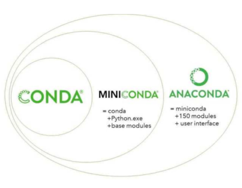

Python Installation
===============================================================================

-------------------------------------------------------------------------------
# Python

Main features: 
- Interpreted language (no compiler) 
- Interactive mode via command line
- Object-oriented and/or functional programming 
- Types 
  - dynamic but strong typing (no variable declaration) 
  - all variables are actually object references: x = 2 
  - predefined complex types: tuple, list, set and dict 
- Statements 
  - control flow: if…elif…else, for and while 
  - grouping via whitespace indentation (no braces, no delimiter) 
- Many libraries (see https://docs.python.org)
- Hello World
  - start: python 
  - hello world: `print("hello world")` 
  - end: quit() 
- Verify current python version: `python --version`  

-------------------------------------------------------------------------------
# Package Manager


## Conda



### Intro
Package manager for Python (and other) packages (libraries):
- Packages are retrieved from a repository 
- Default and configurable repository 
- Supports multiple environments 
  - specific set of packages with specific versions 
  - configuration saved in environment.yaml 
  - can be shared between machines / developers 
  

Command                              | Description
------------------------------------ | ---------------------------------------- 
conda --version                      | Show version
conda info --envs                    | Show environments
conda create -n myenv phython=3.6.2  | Create environment with given python version
conda env remove -n myenv            | Remove environment
conda activate myenv                 | Activate the myenv environment
conda list                           | Show packages of active environment
conda install [pachagename]          | Install Package 
conda update [pachagename]           | Update Package 

> ! Execute command within the Anaconda Shell.

### Environment Yaml

Install a python environment with an `environment.yml` file:

1. Open Anaconda Shell

2. Go to your project folder:
   ..\workspace\myproject

3. Open `environment.yml` and set project name:
   ```
   name: myproject
   dependencies:
     - python=3.9
     - conda==4.9.2
     - pip=20.2.4
     - pip:
         - setuptools==51.0
         - numpy==1.19.4
         - pylint
         - streamlit
   ```

4. Install new Python environment:
   ```
   conda info --envs
   conda env create -f .\environment.yml
   conda env update -f .\environment.yml
   conda activate python-streamlit
   conda list
   ```

5. Analyse with Linter (optional)
   ```
   pylint [folder to scan]
   ```


### References
- Conda
  https://conda.io

- User Guide
  https://conda.io/docs/user-guide/getting-started.html


## Miniconda

Miniconda is a free minimal installer for conda. It is a small, bootstrap version of Anaconda that includes only conda, Python, the packages they depend on, and a small number of other useful packages, including pip, zlib and a few others.


## Anaconda

- Anaconda 
  - Offers a free Python distribution that includes the most important packages and tools for data science tasks 
  - Details see: https://www.anaconda.com

- Company with a typical open source-based business model: additional tools, support, consulting, training and cloud hosting 

- Anaconda Navigator
  - Manages Anaconda installation and included tools 
  - Installed together with Anaconde
  - Details see https://docs.anaconda.com/anaconda/navigator


## PIP

Package manager for Python packages (libraries). Packages are retrieved from a repository (Python package index): 

Command                              | Description
------------------------------------ | ---------------------------------------- 
pip --version                        | Show version
pip list                             | List all installed packages
pip install [packagename]            | Install package
pip install [packagename] == 2.1     | Install package with specific version
pip install –r [requirements.txt]    | Install packages from requirements file
pip install --upgrade [packagename]  | Updata package

References:
- PIP
  https://pypi.org/project/pip

- User Guide
  https://pip.pypa.io/en/stable/user_guide

- PIP Reference:
  https://pip.pypa.io/en/stable/reference/pip_list/

- Python package index
  https://pypi.org 
  

## Differences

### Conda vs. PIP

Conda and pip are often considered as being nearly identical. Although some of the functionality of these two tools overlap, they were designed and should be used for different purposes. 

- **Pip** is the Python Packaging Authority’s recommended tool for installing packages from the Python Package Index, PyPI. Pip installs Python software packaged as wheels or source distributions. The latter may require that the system have compatible compilers, and possibly libraries, installed before invoking pip to succeed.

- **Conda** is a cross platform package and environment manager that installs and manages conda packages from the Anaconda repository as well as from the Anaconda Cloud. Conda packages are binaries. There is never a need to have compilers available to install them. Additionally conda packages are not limited to Python software. They may also contain C or C++ libraries, R packages or any other software.

References:
- Understanding Conda and Pip
  https://www.anaconda.com/blog/understanding-conda-and-pip


### Anaconda vs. Miniconda

Anaconda and miniconda are software distributions that are widely used in data science to simplify package management and deployment.

In this shot, we will cover the differences between the two applications.


**Differences**
There are essentially two main differences:

1. **Number of packages**: Anaconda comes with over 150 data science packages, whereas miniconda comes with only a handful.

2. **Interface**: Anaconda has a graphical user interface (GUI) called the Navigator, while miniconda has a command-line interface.

In other words, miniconda is a mini version of Anaconda. Miniconda ships with just the repository management system and a few packages. Whereas, with Anaconda, you have the distribution of some 150 built-in packages.

**How to choose**

Choose Anaconda if you:
- Are new to conda or Python
- Like the convenience of having Python and over 150 scientific packages   automatically installed at once
- Have the time and disk space (a few minutes and 3 GB)
- Don’t want to have to individually install each of the packages you want to use

Choose miniconda if you:
- Do not mind individually installing each of the packages you want to use
- Do not have time or disk space to install over 150 packages at once
- Want fast access to Python and the conda commands and wish to sort out the other programs later.


Reference:
- https://www.educative.io/edpresso/anaconda-vs-miniconda


-------------------------------------------------------------------------------
# IDEs

## Jupiter Lab

JupyterLab Documentation
- https://jupyterlab.readthedocs.io/en/stable/index.html

JupyterLab Installation
- https://jupyterlab.readthedocs.io/en/stable/getting_started/installation.html

How to change the Jupyter start-up folder
- https://stackoverflow.com/questions/35254852/how-to-change-the-jupyter-start-up-folder


## Jupiter

Notebook-style IDE: 
- Web application that integrates code with text and interactive data visualizations
- Start 
  - Anaconda Navigator 
  - Command line: 
    `jupyter notebook --port [port]` 
  - Set working directory for notebooks:                    
    `jupyter notebook --notebook-dir='[path]'` 
- Runs on http://localhost:[port] 
  - See running servers: 
    `jupyter notebook list` 
  - incl. authentication token
- Create new Notebook via Web UI 
  - Navigate to desired location and click New -> Python3 notebook 
  - File saved as [name].ipynb 
  - Notebook page should open automatically in browser
- Stop notebook 
  - In the notebook page: click File -> Stop and Halt 
  - In the jupyter page: click Running and Shutdown 
- Stop server via killing the process 
  - Linux: 
    - `netstat –tulpn to retrieve pid`
    - `kill [pid]` 
  - Windows 
    - `netstat –ano` - to retrieve pid
    - `taskkill /PID [pid] /F`

References:

- Jupyter Notebook 
  https://jupyter.org

- Jupyter Notebook Documentation
  https://jupyter.org/documentation.html

- Installing Python Packages from a Jupyter Notebook:
  https://jakevdp.github.io/blog/2017/12/05/installing-python-packages-from-jupyter/


## Spyder

Classic IDE for Python (https://pythonhosted.org/spyder)

## PyCharme or IntelliJ Ultimate

PyCharm (https://www.jetbrains.com/pycharm/) 


### Troubleshoot IntelliJ

- Library im IntelliJ nicht `sichtbar`:
  - Falls Installation via IntelliJ oder Conda gemacht und Library immer noch nicht verfügbar: Installation mit `pip install <library>` versuchen
  
- Settings / Jupiter Notebook: Interpreter setzen


-------------------------------------------------------------------------------
_The end._

