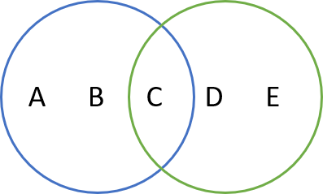

# Python Labs

| Kapitel                                                    | Übungen |
| ---------------------------------------------------------- | ------- |
| **[1. Kick Start](#1-kick-start)**                         | [HelloWorld](#HelloWorld) - [HelloJupiter](#HelloJupiter)   |
| **[2. Grundlagen](#2-grundlagen)**                         | Grundlagen |
|   [2.1 Operatoren & Variablen](#21-operatoren--variablen)  | [Rechteck](#Rechteck) - [Fahrenheit](#Fahrenheit)  |
|   [2.2 Kontrollstrukturen](#22-kontrollstrukturen)         | [Note](#Note) - [Modulo](#Modulo) - [Quadrat](#Quadrat) - [Group](#Group) |
|   [2.3 Exception](#23-exception)                           | [Validation](#Validation) |
|   [2.4 Funktionen & Lambda](#24-Funktionen--Lambda)        | [Maximum](#Maximum) - [Square](#Square) - [Linear](#Linear)  |
| **[3. Datenstrukturen](#3-Datenstrukturen)**               | Datenstrukturen |
|   [3.1 Strings](#31-Strings)                               | [Compare](#Compare) - [SplitDate](#SplitDate) |
|   [3.2 List & Tuples](#32-List--Tuples)                    | [Numbers](#Numbers) - [Filter](#Filter) |
|   [3.3 Sets](#33-Sets)                                     | [Mengen](#Mengen) |
|   [3.4 Dictionaries](#34-Dictionaries)                     | [I18N](#I18N) - [Artikel](#Artikel) |
| **[4. Klassen & Objekte](#4-klassen--objekte)**            | [Kreis](#Kreis) - [Zylinder](#Zylinder) - [Fahrzeug](#Fahrzeug) - [MathUtil](#MathUtil) - [UnitTest](#UnitTest) |
| **[5. File Input/Output](#5-file-inputoutput)**            | [Names](#Names) - [Books](#Books) |
| **[6. Module & Packages](#6-module--packages)**            | [Calculator](#Calculator) |
| **[7. Standard Libraries](#7-standard-libraries)**         | [Directories](#Directories) - [RegEx](#RegEx) | 
| **[8. Data Science Libraries](#8-data-science-libraries)** | [Calculations](#Calculations) - [Mathplot](#Mathplot) |
| **[9. Anwendungsbeispiele](#9-anwendungsbeispiele)**       | [Bookservice](#Bookservice) - [SciKitLearn](#SciKitLearn) |
| **[10. Weitere Übungen](#10-weitere-übungen)**             | [Schaltjahr](#Schaltjahr) - [Tree](#Tree) - [Caesar](#Caesar) |

## 1. Kick Start

### HelloWorld
- Erstellen Sie das Script `helloworld.py` und geben Sie den Text "Hello World" aus.
- Lesen Sie einen Namen ein und geben Sie den Text "Hello [Name]" aus. Der Name entspricht dabei der Eingabe.
- Beispiel Ausgabe:
  ```
  Hello World

  Geben Sie bitte Ihren Name ein: Beatrice
  Hello Beatrice
  ```

### HelloJupiter
- Öffnen Sie das Jupiter Notebook `hellojupiter.ipynb` und führen Sie die aufgeführten Schritte durch.
- Ergänzen Sie die gemachten Ausführungen mit eigenen Versuchen.


**Hinweis:**
- Zum einlesen einer Eingabe können Sie (analog dem folgenden Beispiel) die Methode input() verwenden:
  ```
  eingabe = input("Geben Sie bitte einen Text ein:")
  ```

## 2. Grundlagen

## 2.1 Operatoren & Variablen

Operatoren, Variablen, Kommentare, Hilfe & Typ Informationen

### Rechteck
- Erstellen Sie das Script `rechteck.py` und definieren Sie zwei Variablen für die Länge und Breite.
- Initialisieren Sie die Länge mit dem  Defaultwert 10 und die Breite mit dem Defaultwert 5.
- Berechnen Sie den Umfang und die Fläche der Rechtecks und geben Sie die Resultate auf der Konsole aus.
- Beispiel Ausgabe:
  ```
  Rechteck mit Länge 10 und Breite 5
  - Umfang = 30
  - Fläche = 50
  ```

### Fahrenheit
- Erstellen Sie ein Script `fahrenheit.py` und lesen Sie von der Konsole die Temperatur in Fahrenheit ein.
- Die eingelesene Zahl ist vom Typ Integer (int). Konvertieren Sie diese in eine Gleitkommazahl (float).
- Berechnen Sie die Temperatur in Grad Celisus nach der Formel:
  **Grad Celsius = 5 * (Fahrenheit-32) / 9**
- Geben Sie das Resultat auf der Konsole aus.
- Beispiel Ausgabe:
  ```
  Temperatur in Fahrenheit = 75.2
  Fahrenheit   = 75.2
  Grad Celsius = 24.0
  ```

**Hinweis:**
- Zum einlesen einer Eingabe können Sie (analog dem folgenden Beispiel) die Methode input() verwenden:
  ```
  eingabe = input("Geben Sie bitte einen Text ein:")
  ```
 

## 2.2 Kontrollstrukturen

### Note
- Erstellen Sie das Script `note.py`, das von der Konsole eine Note im Bereich 1-6 als Ganzahl einliest.
  Dazu müssen sie die Eingabe mit einem Cast auf einen Int konvertieren.
- Prüfen Sie die eingelesene Note und falls diese grösser oder gleich 4 ist, geben Sie
  folgenden Text aus: „Der Test ist bestanden“
- Falls die Note kleiner 4 ist geben Sie den Text „Der Test ist nicht bestanden“ aus.
- Starten Sie das Script mit verschiedenen Werten und prüfen Sie die Ausgabe.
- Ergänzen Sie die bisherige Ausgabe nun noch mit einer detaillierten Angabe der Bewertung:
  - Note 6: sehr gut
  - Note 5: gut
  - Note 4: genügend
  - allen anderen Fälle: ungenügend

**Hinweis:**
- Zum einlesen einer Eingabe können Sie (analog dem folgenden Beispiel) die Methode input() verwenden:
  ```
  eingabe = input("Geben Sie bitte einen Text ein:")
  ```

**Zusatz:** 
- Damit Ihr Programm auch bei falschen Eingaben nicht abstürzt, soll am Anfang geprüft werden, 
  ob ein Parameter eingegeben wurde und ob dieser einen korrekten Wertebereich aufweist.
- Falls keine Zahl übergeben wurde machen Sie folgende Ausgabe und beenden Sie
  das Programm mit exit: "Falscher Aufruf: Bitte übergeben Sie eine Zahl!"
- Falls der eingegebene Werte nicht zwischen 1..6 liegt, machen Sie folgende Ausgabe und
  beenden Sie das Programm: "Falscher Wert: Die Note muss einen Wert zwischen 1..6 haben!"


### Modulo
- Erstellen Sie ein Script `note.py`, dass nacheinander alle ungeraden Zahlen zwischen 1 und 30 ausgibt. 
- Verwenden Sie dazu den Modulo Operator `%`.

  
### Quadrat
- Erstellen Sie ein Script, dass das in einer Schleife alle Quadratzahlen ausgibt.
- Die Schleife soll solange durchlaufen werden, wie die berechnete Quadratzahl kleiner oder gleich 15 ist.
- Beispiel Ausgabe: 
  ```
  1 x 1 = 1
  2 x 2 = 4
  usw.
  ```


### Group
- Erstellen Sie ein Script `group.py` mit der folgenden gemischten Liste: [7.5, 'Hello', 42, None, 'World', 1.25, 69, 12]  
- Gruppieren Sie die Listeneinträge in drei verschiedene Listen für Ganzzahlen, Gleitkomma und String Typen.
- Geben Sie das Resultat auf der Konsole aus.
- Beispiel Ausgabe: 
  ```
  values  = [7.5, 'Hello', 42, None, 'World', 1.25, 69, 12]
  - int   = [42, 69, 12]
  - float = [7.5, 1.25]
  - str   = ['Hello', 'World']
  ```

       
## 2.3 Exception

### Validation
- Erstellen Sie ein Script `validation.py` das beliebige Ganzzahlen einliest.
- Das Einlesen der Werte erfolgt mit der input() Methode. Diese liefert einen String.
- Der String soll nun in einen Integer konvertiert und in eine Liste abgelegt werden.
- Falls anstelle einer Ganzahl ein String oder eine Gleitkommazahl eingegeben wird, 
  soll der Fehler bei der Konvertierung abgefangen und eine entsprechende Fehlermeldung ausgegeben werden.  
- Sobald ein 'x' eingelesen wird, wird die Eingabe beendet werden und die eingegebenen Werte werden auf 
  der Konsole ausgegeben.
- Beispiel Ausgabe: 
  ```
  Geben Sie bitte einen Integer ein oder 'x' um die Eingabe zu beenden:
  value = 1
  value = 7
  value = 9.5
  Ungültiger Wert: 9.5 Geben Sie bitte einen Integer Wert ein!
  value = 9
  value = x
  
  Eingegebene Werte:
  [1, 7, 9]
  ```

## 2.4 Funktionen & Lambda

### Maximum
- Erstellen Sie ein Script `maximum.py` mit einer Funktion für die Berechnung des Maximum.
- Der Funktion können 3 Zahlen übergeben werden. Als Resultat wird die grösste Zahl zurückgegeben.
- Es soll auch ein Aufruf der Funktion mit nur 2 Zahlen möglich sein. Dazu können sie dem dritten
  Parameter den Defaultwert `None` zuweisen und diesen in der Methode entsprechend abfragen. 
- Beispiel Ausgabe:
  ```
  max(1,2) = 2
  max(2,1) = 2
  max(9,-15,-12) = 9
  max(9, 15,-12) = 15
  max(9,-15, 12) = 12
  ```

### Square
- Erstellen Sie ein Script `square.py` mit einem Lambda Ausdruck, der als Parameter eine Zahl erhält und die 
  Quadratzahl zurückgibt. 
- Testen Sie den Lambda Ausdruck mit einigen Zahlen.

### Linear
- Erstellen Sie ein Script `linear.py`. 
- Implementieren Sie die Formel für die Berechnung von y in Abhängigkeit von x als Lambda Ausdruck.
- Prüfen Sie die Formel und berechen Sie die Werte von y für die x Werte -2, -1, 0, 1, 2 und 3.
  
- Beispiel Ausgabe:
  ```
  y für x -2 = 0.0
  y für x -1 = 0.5
  y für x 0 = 1.0
  y für x 1 = 1.5
  y für x 2 = 2.0
  y für x 3 = 2.5
  ```


## 3. Datenstrukturen

## 3.1 Strings

### Compare
- Erstellen Sie das Script `compare.py` das zwei Namen einliest.
- Geben Sie die Namen alphabetisch sortiert auf der Konsole aus.
- Beispiel Ausgabe:
  ```
  Please enter:
  Name 1 = Zoé
  Name 2 = Andrea

  Sorted names:
  Andrea
  Zoé
  ```

**Hinweis**:
- Zum einlesen einer Eingabe können Sie (analog dem folgenden Beispiel) die Methode input() verwenden:
  ```
  eingabe = input("Geben Sie bitte einen Text ein:")
  ```


### SplitDate
- Erstellen Sie das Script `splitdate.py` und definieren Sie einen String der ein Datum 
  mit Tagen, Monat und Jahr beinhaltet wie zum Beispiel "17.04.1966" oder "1.3.07".
- Zerlegen Sie nun die Eingabe in drei einzelne Strings für die Tage, den Monat und das Jahr. 
- Geben Sie die einzelnen Strings auf der Konsole aus.
- Beispiel Ausgabe:
  ```
  Date: 17.04.1966
    day   = 17
    month = 04
    year  = 1966
  Date: 1.3.07
    day   = 1
    month = 3
    year  = 07
  ```

**Hinweis**:
- Versuchen Sie einen zweiten Lösungsansatz zu finden. 
- Eine Möglichkeit ist mit Hilfe der split() Methode, eine andere Möglichkeit bietet die index()
  Methode zusammen mit Slicing.

## 3.2 List & Tuples

### Numbers
- Erstellen Sie ein Tuple `numbers` mit den folgenden Nummern: (7, 9, 16, 23, 4, 12, 99, 5)
- Selektieren Sie folgende Elemente und geben Sie diese auf der Konsole aus:
  - Erstes und letztes Element
  - Die ersten zwei Elemente, die letzten zwei Elemente
  - Anzahl Elemente (Länge), Minimum und Maximum
- Beispiel Ausgabe:
  ```
  (7, 9, 16, 23, 4, 12, 99, 5)
  7
  5
  (7, 9)
  (99, 5)
  8
  4
  99
  ```


### Filter
- Erstellen Sie eine Liste `numbers` mit den Zahlen 1..20 und geben Sie diese auf der Konsole aus.
- Selektieren Sie aus der Liste alle geraden Zahlen und speichern Sie diese der Liste `even_numbers`. 
  Verwenden Sie dazu eine Schleife. Geben Sie das Resultat auf der Konsole aus.
- Selektieren Sie aus der Liste alle ungeraden Zahlen und speichern Sie diese der Liste `odd_numbers`. 
  Verwenden Sie dazu die filter() Funktion. Geben Sie das Resultat auf der Konsole aus.
- Beispiel Ausgabe:
  ```
  [1, 2, 3, 4, 5, 6, 7, 8, 9, 10, 11, 12, 13, 14, 15, 16, 17, 18, 19, 20]
  [2, 4, 6, 8, 10, 12, 14, 16, 18, 20]
  [1, 3, 5, 7, 9, 11, 13, 15, 17, 19]
  ```


## 3.3 Sets

### Mengen

- Erstellen Sie das Script `mengen.py` und definieren Sie die beiden Set blue und green wie abgebildet.
- Führen Sie die Mengen Operationen Union, Intersection und Difference durch und geben Sie die Resultate
  auf der Konsole aus. 
- Beispiel Ausgabe:
  ```
  Union        blue+green =  {'A', 'B', 'D', 'C', 'E'}
  Intersection blue/green =  {'C'}
  Difference   blue-green =  {'A', 'B'}
  Difference   green-blue =  {'D', 'E'}
  ```


## 3.4 Dictionaries

### I18N

  | Key  | Greeting     | 
  | --- | ------------- | 
  | de  | Guten morgen  |
  | fr  | Bon jour      |
  | it  | Buongiorno    |
  | en  | Good morning  |

- Erstellen Sie das Script `i18n.py` und verwalten Sie die Greetings aus der Tabelle in einem Dictionary mit dem
  Key als Schlüssel.
- Lesen Sie eine Namen und den Sprachschlüssel von der Konsole ein und Grüssen Sie die Person in Ihrer Sprache.
- Falls ein ungültiger Schrachschlüssel eingegeben wird, verwenden Sie als Default den Key für Englisch. 
- Beispiel Ausgabe:
  ```
  Geben Sie bitte Ihren Namen ein: Anna
  Wählen Sie die Sprache [de, fr, it, en]: fr
  Bon jour
  Anna
  ```

### Artikel

  | Nr  | Name                      | Price  |
  | --- | ------------------------- | ------ |
  | 11  | Bildschirm Belinea X3     | 499.50 |
  | 12  | PC Tastatur Swiss German  |  35.00 |
  | 13  | Logitec Maus              |  17.25 |
  | 14  | USB Hub                   |  25.70 |
  | 15  | Lautsprecher X66-12       |  87.90 |


- Erstellen Sie das Script `article.py` und verwalten Sie die Artikel aus der Tabelle in einem Dictionary:
  - Als Schlüssel können Sie die Artikel Nummer verwenden. 
  - Damit kann auf eine weiteren Dictionary Eintrag zugegriffen werden, welcher die Artikeldaten beinhaltet.
- Geben Sie nun alle Artikel auf der Konsole aus.  
- Suchen Sie den Artikel mit dem tiefsten Preis und geben Sie diesen auf der Konsole aus.
- Aktualisieren Sie alle Artikel Preise und geben Sie einen Disount von 20%. 
  Geben Sie die Artikel auf der Konsole aus.
- Beispiel Ausgabe:
  ```
  List all articles:
  {'name': 'Bildschirm Belinea X3', 'price': 499.5}
  {'name': 'PC Tastatur Swiss German', 'price': 35.0}
  {'name': 'Logitec Maus', 'price': 17.25}
  {'name': 'USB Hub', 'price': 25.7}
  {'name': 'Lautsprecher X66-12', 'price': 87.9}

  Show article with lowest price:
  {'name': 'Logitec Maus', 'price': 17.25}

  Give a 20% discount of all prices and list articles:
  {'name': 'Bildschirm Belinea X3', 'price': 399.6}
  {'name': 'PC Tastatur Swiss German', 'price': 28.0}
  {'name': 'Logitec Maus', 'price': 13.8}
  {'name': 'USB Hub', 'price': 20.560000000000002}
  {'name': 'Lautsprecher X66-12', 'price': 70.32000000000001}
  ```


## 4. Klassen & Objekte

### Kreis
- Erstellen Sie die Klasse `Kreis` mit dem Attribut radius.
- Erstellen Sie die Methode get_umfang() die den Umfang (2*PI*radius) des Kreises zurückgibt
- Erstellen Sie die Methode get_flaeche() die die Kreisfläche (PI * radius^2) zurückgibt
- Erstellen Sie die Methode print() die den Radius, Umfang und die Fläche auf der Konsole ausgibt.
- Testen Sie die Klasse mit mehreren verschiedenen Werten.
- Beispiel Ausgabe:
  ```
  Kreis mit Radius 3
  - Umfang = 18.849
  - Fläche = 28.274
  ```
 
**Hinweis:**
- Für PI gibt es im Python math modul eine vordefinierte Konstante:
  ```
  import math
  print (math.pi)
  ```

### Zylinder 
- Erstellen Sie die Klasse `Zylinder`, die die Klasse Kreis um ein zusätzliches 
  Attribut für die Höhe erweitert.
- Die Klasse soll einen Konstruktor haben beim dem der Radius und die Höhe angegen werden können
- Erstellen Sie die Methode volumen() die das Volumnen (Fläche * Höhe) des Zylinder zurückgibt.
- Überschreiben Sie die Methode print() so, dass die Angaben des Zylinder ausgegeben werden.
  
- Erstellen Sie je eine Instanz von Kreis und Zylinder und rufen Sie die beiden print()   
  Methoden auf.
- Beispiel Ausgabe:
  ```
  Kreis mit Radius 3
  - Umfang = 18.84955592153876
  - Fläche = 28.274333882308138
  Zylinder mit Radius 3 und Höhe 5
  - Volumen = 141.3716694115407  
  ```

**Hinweis:**
- Die Klasse Kreis kann wie folgt in der Datei Zylinder importiert werden:
  ```
  from Kreis import Kreis
  ```
  
### Fahrzeug
- Die folgenden Fahrzeuge sollen in einer Vererbungshierarchie abgebildet werden:
  - Fahrrad mit den Attributen Farbe, Baujahr und Marke und den Operationen: 
    - fahren() gibt auf der Konsole den Text "Fahrrad fährt" aus 
    - print() gibt alle Attributwerte aus
  - PKW mit den Attributen Farbe, Baujahr und Sitzplätze und den Operationen:
    - fahren() gibt auf der Konsole den Text "PKW fährt" aus 
    - print() gibt alle Attributwerte aus
- Erstellen Sie ein Klassendiagramm mit einer Vererbungshierarchie, so dass die gemeinsamen 
  Attribute und Operationen in einer gemeinsamen Oberklassen gruppiert werden.
- Implementieren Sie das Klassendiagramm mit Python in der Datei `Fahrzeug.py`
- Erstellen Sie einen Test und überprüfen Sie Ihre Lösung, indem Sie je eine Instanz von
  Fahrrad und PKW erstellen und die print() und fahren() Methoden aufrufen.
- Beispiel Ausgabe:
  ```
  Fahrrad mit Farbe=silber, Baujahr=2020, Marke=Scott
  Fahrrad fährt...
  PKW mit Farbe=rot, Baujahr=2007, Sitzplätze=4
  PKW fährt...
  ```

### MathUtil
- Erstellen Sie eine Klasse `MathUtil` mit folgenden statischen Methoden:
  - min (a, b, c)
    Berechnung und Rückgabe des Minimums der drei Zahlen.
  - max (a, b, c)
    Berechnung und Rückgabe des Maximum der drei Zahlen.
- Testen Sie die beiden Hilfsmethoden mit verschiedenen Zahlenwerten und geben Sie die Resultate
  auf der Konsole aus.
- Beispiel Ausgabe:
  ```
  Das Maximum von 5,12,20 ist: 20
  Das Minimum von 5,12,20 ist: 5
  Das Maximum von 49,3,14 ist: 49
  Das Minimum von 49,3,14 ist: 3
  ```

### UnitTest

**Vorbereitung**
Per default sind im VS Code Unit Tests ausgeschaltet. Diese müssen sie zuerst aktivieren. Folgen Sie dazu 
der Beschreibung in den Installationshinweisen `Python-Installation.pdf`.

**Ausgangslage**
- Unit Tests helfen uns, den Code automatisiert zu testen. 
- Dabei wird eine zu prüfende Methode aufgerufen und das aktuellen Resultat mit einen erwarteten Wert verglichen. 
  Dazu gibt es entsprechende Vergleichsmethoden. 
- Unit Tests können direkt aus der Entwickungsumgebung aufgerufen werden als auch von automatisierten CI/CD Pipelines.

**Aufgabe**
- Die beiden Methoden `min()` und `max()` der MathUtil Klasse sollen mit einem Unit Test überprüft werden.
- Dazu wird eine Testklasse wie folgt benötigt:
  ```
  import unittest
  class MathUtilTest(unittest.TestCase):
    ...
  ```
- Für jeden Test den Sie ausführen möchten, können Sie nun eine Methode mit dem Prefix `test` erstellen
  und die gewünschte Funktion überprüfen.
  ```
    def test_max(self):
        expected = 20
        actual = MathUtil.max(5,12,20)
        self.assertEqual(expected, actual)
  ```
- Erstellen Sie dazu die Klasse `MathUtil_test` und definieren Sie entsprechende Testmethoden zum überprüfen
  der beiden Methoden `min()` und `max()`.
- Führen Sie den Test aus der Entwicklungsumgebung aus und überrüfen Sie die Resultate.


## 5. File Input/Output

### Names
- Erstellen Sie das Script `names.py` und lesen Sie die Textdatei [names.txt](05-file/names.txt) ein.
- Diese enthält Vornamen in der folgenden Form:
  ```
  Elias
  Theo
  ...
  Ida
  Anna
  ```
- Sortieren Sie die Vornamen alphabetisch und speichern Sie diese wieder im Text Format ab.
- Beispiel `names-sortet.txt`:
  ```
  Anna
  Anton
  ...
  Sarah
  Theo
  ```


### Books
- Erstellen Sie das Script `books.py` und lesen Sie die Textdatei [books.txt](05-file/books.txt) ein.
- Diese enthält Bücherdaten in der fogenden Form:
  ```
  ISBN
  Title
  Author
  Publisher

  978-0-316-45742-2
  The Coast-To-Coast Murders
  James Patterson
  Little Brown USA

  978-0-525-95498-9
  ...
  ```
- Erstellen Sie nun eine Liste von Einträgen. Jeder Eintrag beinhaltet die Daten eines "Blocks" und ist
  selber auch wieder eine Liste, wie nachfolgend dargestellt. 
  ```
  ['ISBN', 'Title', 'Author', 'Publisher']
  ['978-0-316-45742-2', 'The Coast-To-Coast Murders', 'James Patterson', 'Little Brown USA']
  u.s.w.  
  ```
- Speichern sie die aufbereiteten Daten im CSV Format ab.
- Beispiel `books.csv`:
  ```
  ISBN,Title,Author,Publisher
  978-0-316-45742-2,The Coast-To-Coast Murders,James Patterson,Little Brown USA
  978-0-525-95498-9,The Evening and the Morning,Ken Follett,Penguin LCC US
  978-1-250-14523-9,All the Devils Are Here,Louise Penny,Macmillan USA
  ```

## 6. Module & Packages

### Calculator
- Erstellen Sie das Modul `calculator.py` mit folgenden Methoden:
  - add(x, y) für die Addition x + y
  - sub(x, y) für die Subtraktion x - y
  - mul(x, y) für die Mulitiplikation x * y
  - div(x, y) für die Division x / y
- Erstellen Sie das Script 'calculator-ui.py' dass eine Rechnung einliest, ausführt und das Resultat anzeigt. 
  Dazu werden die Operationen aus dem calculator Modul importiert.  
- Als Eingabe wird ein String eingelesen mit der Operation und den Operanden, 
  wie zum Beispiel `5 + 2` oder `7 / 3`.
- Fangen Sie folgende Fehler ab und geben Sie eine entsprechende Meldung aus: 
  - Ungültier Operator
  - Divison durch 0
- Beispiele:
  ```
  Calculate: 7 * 3
  21.0
  
  Calculate: 5 = 6
  Unknown operator
  
  Calculate: 13 / 0
  Division by zero    
  ```
 
## 7. Standard Libraries
  
### Directories
- Erstellen Sie das Script `dirs.py` dass mit Hilfe einer Rekursion den Inhalt des
  Verzeichnis `c:/../python/example/09-apps/` vom Python Projekt ausgibt.
- Verwenden Sie dazu die Methoden `os.listdir()`, `os.path.isdir()` und `os.path.isfile()` 
  der os Bibliothek.
- Geben Sie die Datei- und Verzeichnisnamen verschachtelt aus, wie im folgenden Beispiel
  dargestellt:
  ```
  bookservice
    books.py
    bookservice.py
    debug.bat
    debug.sh
    run.bat
    run.sh
    static
      404.html
      index.html
  movies
    movieservice.py
    run.bat
    run.sh
    model
      model.py
      imdb
        imdb_mlp.pkl
       imdb_tfidf.pkl
    static
      index.html
  scikit
    plot_cluster_iris.ipynb
    plot_iris_dataset.ipynb
    plot_pca_iris.ipynb
    references.md
  ```
  
### RegEx
Schauen Sie sich die Regular Expression Beispiele aus den Kursunterlagen oder den folgenden Tutorials 
an und probieren Sie einige davon aus:
- https://developers.google.com/edu/python/regular-expressions
- https://learnbyexample.github.io/python-regex-cheatsheet 
- https://docs.python.org/3/howto/regex.html

  
## 8. Data Science Libraries

### Calculations
Erstellen Sie ein Script `calculations.py` und importieren Sie die numpy Biblothek.
Führen Sie anschliessend folgenden Aufgaben aus:

1. Berechnungen
   - Erstellen Sie die folgenden drei Numpy Arrays.
     - a = [20,30,40,50]
     - b = [10,15,10,75]
     - c = [17,12,-3,52]
   - Berechnen Sie elementweise: 
     - x = a - b 
     - y = x + c 
   - Geben Sie die Resultate auf der Konsole aus. 

2. 6er Reihe
   - Erstellen Sie einen Numpy Array mit den Werten der 6er Reihe 
     (verwenden Sie dazu die Range Funktion).
   - Berechnen Sie folgende Werte und geben Sie diese auf der Konsole aus:
     - Minimum
     - Maximum
     - Mittelwert
     - Standardabweichung  

3. Lottozahlen
   - Erstellen Sie mit der Numpy Funktion ranom.randint() sechs Zufallszahlen 
     im Bereich von 1 bis 45.
   - Jede Zufallszahl darf nur einmal vorkommen in der generierten Liste.
   - Geben Sie die Zahlen auf der Konsole aus.
   
Beispiel Ausgabe:
```
Berechnungen:
x: [ 10  15  30 -25]
y: [27 27 27 27]

6er Reihe: [ 6 12 18 24 30 36 42 48 54 60]
Minimum: 6
Maximum: 60
Mittelwert: 33.0
Standardabweichung: 17.233687939614086

Lottozahlen:
{34, 3, 8, 43, 18, 25}
```

### Mathplot
Arbeiten Sie das Jupiter Notebook `mathplot-lib.ipynb` (im Verzeichnis lab/08-ds-libs) 
durch und lernen Sie einige Möglichkeiten der Mathplot Bibliothek kennen.


## 9. Anwendungsbeispiele
Schauen Sie sich die folgenden Anwendungsbeispiel (im Verzeichnis lab/09-apps) an.

**Vorbereitung**
Je nach Anwendungsbeispiel müssen weiter Packages installiert werden. Folgen Sie dazu der Beschreibung in den 
Installationshinweisen `Python-Installation.pdf`.

### Bookservice
- [Beispiel eines REST Services mit Flask](09-apps/bookservice)

### SciKitLearn
- [Beispiel Iris DataSet](09-apps/scikit/plot_iris_dataset.ipynb)
- [Beispiel Iris K-means Clustering](09-apps/scikit/plot_cluster_iris.ipynb)
- [Beispiel Iris PCA](09-apps/scikit/plot_pca_iris.ipynb)

## 10. Weitere Übungen

### Schaltjahr
- Erstellen Sie das Script `schaltjahr.py` welches eine Jahreszahl einliest und anschliessend ausgibt
  ob es sich um ein Schaltjahr handelt oder nicht. 

Regeln zur Bestimmung eines Schaltjahr:

- Alle 4 Jahre wird mit dem 29. Februar ein Schalttag eingefügt. Damit wird dem Umstand Rechnung getragen, 
  dass ein Jahr nach dem gregorianischen Kalenderjahr nicht exakt 365 Tage dauert. 

- Pro Jahr gibt es mit dieser Lösung noch einen kleinen Fehler von einem Hundertertstel Tag zuviel.
  Deshalb wird alle 100 Jahre auf ein Schaltag verzichtet und zwar genau dann, wenn die Jahreszahl genau
  durch 100 teilbar ist. So ist zum Beispiel 1900 kein Schaltjahr, obwohl es durch 4 teilbar ist.

- Nun braucht es noch eine weitere kleine Korrektur. Daher wird alle 400 Jahre noch ein Schaltjahr 
  eingefügt, obwohl die Jahreszahl durch 100 teilbar ist. Mit dieser Regel ist zum Beispiel das Jahr 2000
  ein Schaltjahr obwohl es durch 4 und 100 teilbar ist.  
  

### Tree

- Erstellen Sie das Script `tree.py` welches folgende Aufgaben löst.
- Erstellung Klasse Node mit den Attributen `value`, `parent` und `childs` sowie allen benötigten Methoden.
- Erstellung Klasse Testdata die den abgebildeten Tree aufbaut.
- Erstellung Klasse Recursion mit einer Funktion run(root), welche den Baum mit Hilfe einer Rekursion durchläuft und die Werte ausgibt. 
- Erstellung Klasse Traverse mit einer Funktion run(root), welche den Baum ohne Rekursion durchläuft und die Werte ausgibt.
- Test der beiden Klassen   

### Caesar

Die [Caesar-Verschlüsselung](https://de.wikipedia.org/wiki/Caesar-Verschl%C3%BCsselung) ist ein Verfahren für eine
einfache Verschlüsselung von Text in einen Geheimcode. Dieser kann anschliessend auch wieder Entschlüsselt werden.
- Bei der Verschlüsselung wird jeder Buchstabe durch einen anderen aus dem Alphabet ersetzt.
- Dabei wird jeder Buchstabe  (eines geordneten Alphabets) um eine bestimmte Anzahl nach rechts verschoben/rotiert. 
- Die Anzahl Stellen um welche die Buchstaben rotiert werden sollen wird mit dem sogenannten Schlüssel angegeben.
  Dieser ist für jeden Buchstaben gleich.
- Beim Entschlüsseln wird der Geheimcode entsprechend wieder zurück rotiert. 
 
Schreiben sie eine Anwendung, welche einen Text und Schlüssel einliest.
- Verschlüsseln Sie den Text nach dem Ceasar Verfahren und geben Sie diesen auf der Konsole aus.
- Anschliessend entschlüsseln Sie den Text wieder und geben das Reslutat ebenfalls auf der Konsole aus.

**Tipp:**:
- Die Buchstaben können in eine Zahl (und wieder zurück) konvertiert werden. 
- Damit können Sie die Verschiebung "berechnen". 
  ```
  ord('A')          # 65
  ord('Z')          # 90
  ord('a')          # 97
  ord('z')          # 122
  chr(ord('a')+1)   # 'b'
  ```
- Falls im Text ein Zeichen vorkommt, dass kein Buchstabe zwischen A-Z und a-z ist,  
  so lassen Sie dieses Unverschlüsselt. Beispiel: 
  - `ABC` mit Schlüssel 2 = `CDE`
  - `A:C` mit Schlüssel 2 = `C:E`

       
---
[Home](../README.md) &nbsp; | &nbsp; [Top](#Python-Labs) &nbsp; | &nbsp; [Aktuelle Kurse](https://www.iten-engineering.ch/course)
